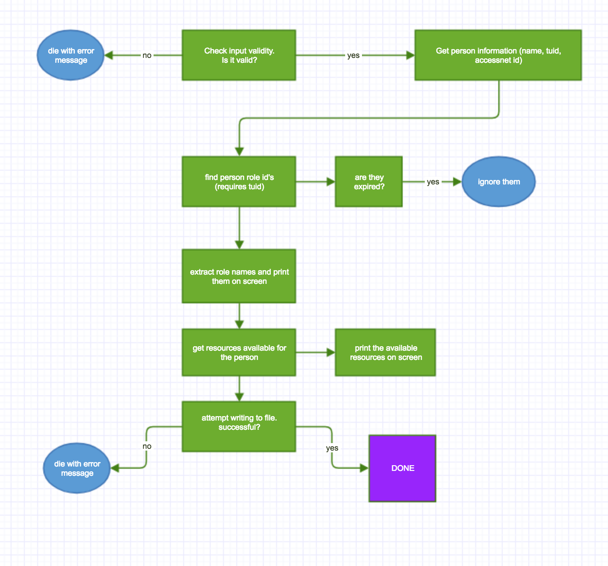

# Part 1: Why learn and use C? (25 points)

For me, C has been a very powerful tool to understand the low level operations that are going on under the hood. Before this class I laerned Microsoft Assembly, but never tried comparing the assembly file generated by a compiler to what I learned. In this course we learned x86 gas assembly, and I compiled lots of programs to see how the most widely used standard (gnu compiler) generates assembly code and how it tries to optimise for different scenarios (e.g: for file size or for speed). What is so special about C is that it is a very precise and simple strong typed programming language, which means I can always have a rough idea about how the assembly code for the algorithms I write will look like, and use that to understand how to write efficient code. Plus, I believe it is always good to know the fundamentals no matter how broadly the platform is used.

Another benefits of learning C is that since C and C++ are the languages used for almost all operating systems and microprocessors due to their efficiency and strong-typed syntax, learning one or both of the languages is extremely useful for anyone who has interest in exposing low-level features of a computer or developing physical products. Especially for microprocessors, where the amount of memory is usually small and power consumption is critical, C and C++ suit the job perfectly because the amount of memory needed to run a program can be precisely determined, and when needed, can be managed dynamically and very precisely. The power consumption can also be estimated very accurately and optimized because the cost of every operation can be modelled very precisely, and even estimated easily when writing the program.


# Part 2: Defining the Problem and your Approach Towards Finding a Solution (75 points)



# Part 3: Writing Pseudo-code (75 points)
```bash
prompt_for_input()
id = standard input
if (id is numeric):
    accessNetId = id
    if(accessNetId is not valid) die()
    tuid = getValue with accessnetid
else:
    tuid = id
    if(tuid is not valid) die()
    accessNetId = getValue with tuid

getIdentityInfo()
printIdentityInfo()

role_ids = getRuleIds()
role_name = getRoleNames()
print(roles)

resources = getResources()
print(resources)
log(tuid and resources)
print(if log was successful)

done
```


# Part 4: Implementing the Solution (100 points)
(solution is in the folder. My file name is util.c and util.h)
I went with the getValue option, and also checked the validity of input.

# Part 5: Testing your Solution (25 points)
I created a makefile. To test use:
```bash
make && ./debug.out
```